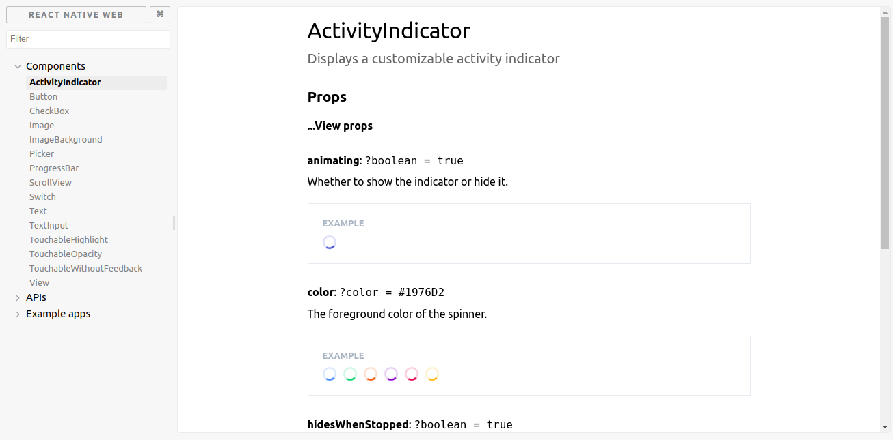

# react、vue 组件开发利器：storybook

对于前端开发来说，组件化技术已经是一门必修课了，这其中又主要以 [react](https://github.com/facebook/react) 和 [vue](https://github.com/vuejs/vue) 为主。但平时在开发组件，尤其是公共组件或者第三方组件库的时候，往往会有一些困扰：

- 不能很好的管理多个组件，尤其是在组件预览的时候，不能一目了然
- 在组件预览的时候，也不能很好的反应一个组件的多个不同状态
- 自动化交互测试可以使用 [enzyme](https://github.com/airbnb/enzyme)，但很多时候还得手动测试，就比较麻烦了
- 在写文档的时候，需要将组件预览和文档写在一起，并需要切换到不同的状态，就比较吃力了

所以，[storybook](https://github.com/storybooks/storybook) 就是为了解决这些问题而出现的，它为你的组件搭建了一个强大的开发环境，主要提供了以下的几个功能：

- 提供了一个强大的 UI 组件管理页面，可以很便捷、清晰的分组、管理多个组件或一个组件的多个不同状态
- 在自动化交互测试之外，可以很方便的进行手动交互测试，并且可以动态改变组件参数，查看视图变化
- 可以将组件预览导出为静态资源，这样就可以很方便查看组件的文档和不同参数对应的不同视图
- 还有一系列的插件，提供了很多额外的功能，帮助你更好的开发、测试、优化组件

社区已经有很多组件库都在使用 [storybook](https://github.com/storybooks/storybook) 开发，比如：

- [react-dates](https://github.com/airbnb/react-dates) 的 `storybook` [react-dates - storybook](http://airbnb.io/react-dates/)
- [react-native-web](https://github.com/necolas/react-native-web) 的 `storybook` [react-native-web - storybook](http://necolas.github.io/react-native-web/storybook/)

再顺便截个图吧



## 1. 框架适配

- [React](https://github.com/storybooks/storybook/blob/master/app/react)
- [React Native](https://github.com/storybooks/storybook/blob/master/app/react-native)
- [Vue](https://github.com/storybooks/storybook/blob/master/app/vue)
- [Angular](https://github.com/storybooks/storybook/blob/master/app/angular)
- [Polymer](https://github.com/storybooks/storybook/blob/master/app/polymer)
- [Mithril](https://github.com/storybooks/storybook/blob/master/app/mithril): 目前尚处 `alpha` 阶段
- [Marko](https://github.com/storybooks/storybook/blob/master/app/marko): 目前尚处 `alpha` 阶段
- [HTML](https://github.com/storybooks/storybook/blob/master/app/html): 目前尚处 `alpha` 阶段
- [Svelte](https://github.com/storybooks/storybook/blob/master/app/svelte): 目前尚处 `alpha` 阶段
- [Riot](https://github.com/storybooks/storybook/blob/master/app/riot) : 目前尚处 `alpha` 阶段

## 2. 开发与命令

## 2.1 如何写一个 `story` 

查看 [storybook - Writing Stories](https://storybook.js.org/basics/writing-stories/)，了解怎么写 `stories` 与怎么用插件。

## 2.2 添加 `storybook`

```
# 安装全局命令
npm i -g @storybook/cli

# 初始化已有项目（不会对原项目产生影响，只添加必要的配置与脚本而已）
cd my-project-directory
getstorybook

# 运行 storybook
npm run storybook
```

如果需要手动添加 `storybook` 或它的插件，可以查看：

- [Storybook for React](https://storybook.js.org/basics/guide-react/)
- [Storybook for Vue](https://storybook.js.org/basics/guide-vue/)
- [Storybook for Angular](https://storybook.js.org/basics/guide-angular/)

## 2.3 将组件预览导出为静态资源

```
# 添加到 package.json 的 scripts
{
  "export-storybook": "build-storybook -c .storybook -o .out"
}

# 运行命令
npm run export-storybook
```

## 3. 后续

更多博客，查看 [https://github.com/senntyou/blogs](https://github.com/senntyou/blogs)

作者：[深予之 (@senntyou)](https://github.com/senntyou)

版权声明：自由转载-非商用-非衍生-保持署名（[创意共享3.0许可证](https://creativecommons.org/licenses/by-nc-nd/3.0/deed.zh)）
