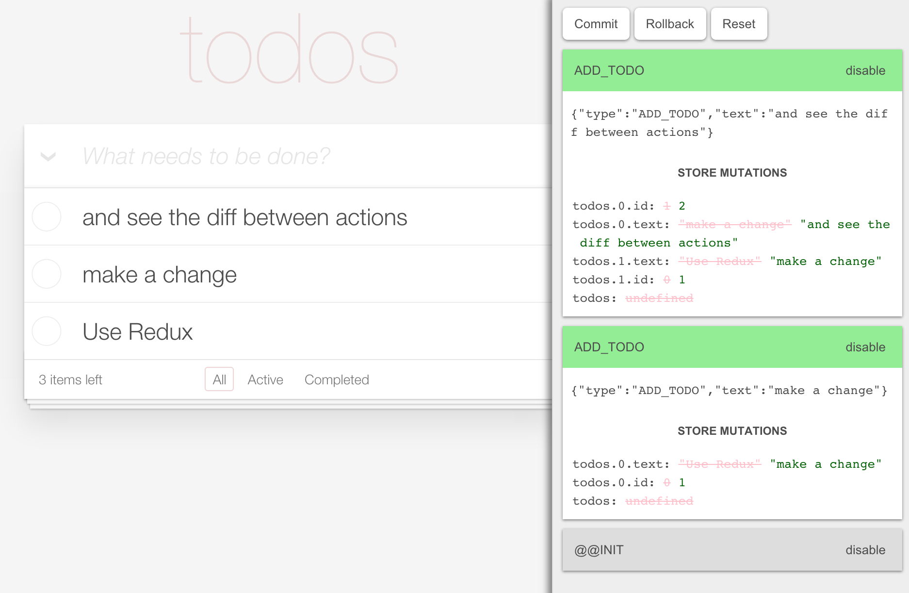

# 前端开发需要了解的工具集合：webpack, eslint, prettier, ...

前端开发需要了解的一些工具，这些工具能够帮助你在项目开发中事半功倍。

## 1. [nrm](https://github.com/Pana/nrm): `npm` registry 管理器

`registry`: `npm` 远程仓库的地址。

由于众所周知的原因，`npm` 官方仓库在国内特别的慢，所以我们需要用一些替代性方案，一种方案就是切换 `npm` registry 到国内的镜像仓库。

所以，一般我们会这样做：

```
# 切换到淘宝 npm 仓库
npm config set registry https://registry.npm.taobao.org/
```

但是这样做会比较麻烦，因为切换的时候得记住 registry 的 url 地址。所以就需要 [nrm](https://github.com/Pana/nrm) 来管理 `npm` registry。

#### 安装

```
npm install -g nrm
```

#### 内置的 registry

```
npm ---- https://registry.npmjs.org/
cnpm --- http://r.cnpmjs.org/
taobao - https://registry.npm.taobao.org/
nj ----- https://registry.nodejitsu.com/
rednpm - http://registry.mirror.cqupt.edu.cn/
npmMirror  https://skimdb.npmjs.com/registry/
edunpm - http://registry.enpmjs.org/
```

#### 使用

```
# 切换到 taobao registry
nrm use taobao

# 切换到 npm 官方 registry
nrm use npm

# 添加自己的 registry
nrm add yourName yourRegistry
```

## 2. [cnpm](https://github.com/cnpm/cnpm): 使用国内镜像仓库的 `npm` 客户端

相当于是 [npm](https://github.com/npm/npm) 的一个克隆版本，它的命令中除了 `publish` 之外，其他的与 `npm` 的命令一致。内部默认使用的是国内的 `npm` 代码仓库 [https://cnpmjs.org/](https://cnpmjs.org/)，当然你也可以改为自己的。

如果你不喜欢使用 [nrm](https://github.com/Pana/nrm) 切换 `npm` registry，可以把 `npm` 和 `cnpm` 这两者一起用。 

另外，它一般还会和 [cnpmjs.org](https://github.com/cnpm/cnpmjs.org) 配合使用。

#### 安装

```
npm install -g cnpm
```

## 3. [yarn](https://github.com/yarnpkg/yarn): 类似 `npm` 的依赖管理工具

类似 `npm` 的依赖管理工具，但 `yarn` 缓存了每个下载过的包，所以再次使用时无需重复下载，同时利用并行下载以最大化资源利用率，因此安装速度更快。

并且在开发 [react-native](https://github.com/facebook/react-native) 应用程序时，是强烈建议使用 [yarn](https://github.com/yarnpkg/yarn) 的，因为如果非要用 npm, 必须使用 npm < 5 版本。

#### 安装

```
npm install -g yarn
```

## 4. [webpack](https://github.com/webpack/webpack): 前端打包工具

现在前端打包基本上都会用 [webpack](https://github.com/webpack/webpack)，它不仅能打包源代码文件（如 `js, css, html, ts, ...`），还能打包静态资源文件（如 `images, fonts, ...`），并且还能打包按需加载 SPA 应用。总之，`webpack` 是前端打包的不二选择。

#### 安装

```
# 全局
npm install -g webpack

# 本地
npm install --save-dev webpack
```

## 5. [babel](https://github.com/babel/babel): es6 -> es5 转码器

有 [babel](https://github.com/babel/babel) 在，你就可以写最新版的 JavaScript 语法（`es6, es7, es2015, ...`），然后由 `babel` 把你的源代码转码成你所需要的 JavaScript 语法，比如浏览器端运行的 `es5`。`babel` 一般都是配合 [webpack](https://github.com/webpack/webpack)、[rollup](https://github.com/rollup/rollup)、[parcel](https://github.com/parcel-bundler/parcel) 等打包构建工具一起使用，详细参考 [babel - setup](https://babeljs.io/en/setup)。

#### 安装

```
# 全局
npm install -g babel-cli

# 本地
npm install --save-dev babel-cli
```

## 6. [eslint](https://github.com/eslint/eslint): js 语法（包括 jsx 语法）检查与矫正

这个工具能够检查 js 语法（包括 jsx 语法），然后最大程度的矫正不符合规范的代码。对于提升个人代码质量，保证团队代码规范和代码风格是相当有用的。

[eslint](https://github.com/eslint/eslint) 一般会配合 [husky](https://github.com/typicode/husky) 与 [lint-staged](https://github.com/okonet/lint-staged) 一起使用。详细用法可以参考 [怎样提升代码质量](https://github.com/senntyou/blogs/blob/master/advanced/3.md)。

#### 安装

```
# 全局
npm install -g eslint

# 本地
npm install --save-dev eslint
```

## 7. [stylelint](https://github.com/stylelint/stylelint): css 语法（包括 less, scss 语法）检查与矫正

这个工具能够检查 css 语法（包括 less, scss 语法），然后最大程度的矫正不符合规范的代码。对于提升个人代码质量，保证团队代码规范和代码风格是相当有用的。

[stylelint](https://github.com/stylelint/stylelint) 一般会配合 [husky](https://github.com/typicode/husky) 与 [lint-staged](https://github.com/okonet/lint-staged) 一起使用。详细用法可以参考 [怎样提升代码质量](https://github.com/senntyou/blogs/blob/master/advanced/3.md)。

#### 安装

```
# 全局
npm install -g stylelint

# 本地
npm install --save-dev stylelint
```

## 8. [prettier](https://github.com/prettier/prettier): 代码格式优化

这个工具能够优化 `js, jsx, ts, css, less, scss, json, md, ...`，对于保证团队代码风格是相当有用的。

[prettier](https://github.com/prettier/prettier) 一般会配合 [husky](https://github.com/typicode/husky) 与 [lint-staged](https://github.com/okonet/lint-staged) 一起使用。详细用法可以参考 [怎样提升代码质量](https://github.com/senntyou/blogs/blob/master/advanced/3.md)。

#### 安装

```
# 全局
npm install -g prettier

# 本地
npm install --save-dev prettier
```

## 9. [gulp](https://github.com/gulpjs/gulp): 基于流的自动化构建工具

在 [webpack](https://github.com/webpack/webpack) 出现之前，前端的构建任务很多都是由 [gulp](https://github.com/gulpjs/gulp) 来完成的。`webpack` 出现之后，`gulp` 在打包构建这一块功能则退居二线，但是 `webpack` 只负责代码打包，很多其他工作还是由 `gulp` 来完成，比如上传打包文件到服务器，让打包文件进行更多流操作等。所以，很多情况下都是 `gulp` 与 `webpack` 配合使用。

#### 安装

```
# 全局
npm install -g gulp

# 本地
npm install --save-dev gulp
```

## 10. [jest](https://github.com/facebook/jest): js 测试库

在 Facebook 内部，包括 [react](https://github.com/facebook/react) 应用在内的所有 JavaScript 代码都是用 [jest](https://github.com/facebook/jest) 来测试的。它的一个理念就是提供一套完整集成的 “零配置” 测试体验。所以，使用 `jest` 来测试 JavaScript 是一件很愉快的事情。

#### 安装

```
npm install --save-dev jest
```

## 11. [enzyme](https://github.com/airbnb/enzyme): [react](https://github.com/facebook/react) 组件测试库

[jest](https://github.com/facebook/jest) 只是单纯用来测试 JavaScript 的，而 `react` 组件的测试，就需要用到 airbnb 出品的 [enzyme](https://github.com/airbnb/enzyme) 了。一般 `enzyme` 会和 `jest` 一起使用。

#### 安装

```
npm install --save-dev enzyme enzyme-adapter-react-16
```

## 12. [react-devtools](https://github.com/facebook/react-devtools): chrome 开发者工具插件 for [react](https://github.com/facebook/react)

这是专门针对 [react](https://github.com/facebook/react) 组件开发的 chrome 开发者工具插件，就像开发者工具的 `Elements` 一样，可以查看整个页面的 `react` 组件树和每个组件的属性和状态，并且可以动态的更改属性和状态，然后会更新 UI 到应用上。


#### 安装

通过 chrome 应用商店安装 [chrome - react-developer-tools](https://chrome.google.com/webstore/detail/react-developer-tools/fmkadmapgofadopljbjfkapdkoienihi).

其他安装方式查看 [react-devtools](https://github.com/facebook/react-devtools).

## 13. [redux-devtools](https://github.com/reduxjs/redux-devtools) 与 [redux-devtools-extension](https://github.com/zalmoxisus/redux-devtools-extension): chrome 开发者工具插件 for [redux](https://github.com/reduxjs/redux)

这是专门针对 [redux](https://github.com/reduxjs/redux) 开发的 chrome 开发者工具插件，就像 [react-devtools](https://github.com/facebook/react-devtools) 一样，可以查看整个页面的 `redux` store 及其变化，并且可以动态的派发 `action`，然后会更新 UI 到应用上。

#### 13.1 安装 [redux-devtools](https://github.com/reduxjs/redux-devtools)

这种安装方式，`redux-devtools` 会嵌入到页面中，成为页面的一部分。

```
npm install --save-dev redux-devtools

# 还可以安装
npm install --save-dev redux-devtools-log-monitor
npm install --save-dev redux-devtools-dock-monitor
```

更多信息参考 [redux-devtools - Walkthrough](https://github.com/reduxjs/redux-devtools/blob/master/docs/Walkthrough.md).



#### 13.2 安装 [redux-devtools-extension](https://github.com/zalmoxisus/redux-devtools-extension)

这种安装方式是成为浏览器开发者工具的一个插件。

通过 chrome 应用商店安装 [chrome - redux-devtools](https://chrome.google.com/webstore/detail/redux-devtools/lmhkpmbekcpmknklioeibfkpmmfibljd).

其他安装方式查看 [redux-devtools-extension](https://github.com/zalmoxisus/redux-devtools-extension).


## 14. [vue-devtools](https://github.com/vuejs/vue-devtools): chrome 开发者工具插件 for [vue](https://github.com/vuejs/vue)

这是专门针对 [vue](https://github.com/vuejs/vue) 组件开发的 chrome 开发者工具插件，就像开发者工具的 `Elements` 一样，可以查看整个页面的 `vue` 组件树和每个组件的 `data`，并且可以动态的更改 `data`，然后会更新 UI 到应用上。


#### 安装

通过 chrome 应用商店安装 [chrome - vuejs-devtools](https://chrome.google.com/webstore/detail/vuejs-devtools/nhdogjmejiglipccpnnnanhbledajbpd).

其他安装方式查看 [vue-devtools](https://github.com/vuejs/vue-devtools).

## 15. 后续

更多博客，查看 [https://github.com/senntyou/blogs](https://github.com/senntyou/blogs)

作者：[深予之 (@senntyou)](https://github.com/senntyou)

版权声明：自由转载-非商用-非衍生-保持署名（[创意共享3.0许可证](https://creativecommons.org/licenses/by-nc-nd/3.0/deed.zh)）
