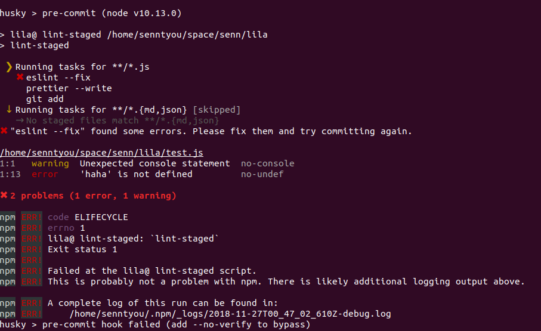

# 从 0 到 1 再到 100, 搭建、编写、构建一个前端项目

## 1. 选择现成的项目模板还是自己搭建项目骨架

搭建一个前端项目的方式有两种：选择现成的项目模板、自己搭建项目骨架。

选择一个现成项目模板是搭建一个项目最快的方式，模板已经把基本的骨架都搭建好了，你只需要向里面填充具体的业务代码，就可以通过内置的工具与命令构建代码、部署到服务器等。

一般来说，一个现成的项目模板会预定义一定的目录结构、书写方式，在编写项目代码时需要遵循相应的规范；也会内置必要的工具，比如 [.editorconfig]([http://editorconfig.org](http://editorconfig.org))、[eslint](https://github.com/eslint/eslint)、[stylelint](https://github.com/stylelint/stylelint)、[prettier](https://github.com/prettier/prettier)、[husky](https://github.com/typicode/husky)、[lint-staged](https://github.com/okonet/lint-staged) 等；也会内置必要的命令（\[package.json | scripts]），比如 `本地开发：npm run dev`、`本地预览：npm run start`、`构建：npm run build`、`部署：npm run deploy` 等。

社区比较好的项目模板：

- [react-boilerplate](https://github.com/react-boilerplate/react-boilerplate)
- [ant-design-pro](https://github.com/ant-design/ant-design-pro)
- [vue-element-admin](https://github.com/PanJiaChen/vue-element-admin)
- [react-starter-kit](https://github.com/kriasoft/react-starter-kit)
- [create-react-app](https://github.com/facebook/create-react-app)
- [create-lila-app](https://github.com/senntyou/lila/tree/master/packages/create-lila-app)（我自己用的，嘻嘻）

这些模板的使用又分为两种：使用 `git` 直接克隆到本地、使用命令行创建。

（使用现有模板构建的项目，可以跳过第 2 ～ 7 步）

### 1.1 使用 `git` 直接克隆到本地

这是一种真正意义上的模板，可以直接到模板项目的 `github` 主页，就能看到整个骨架，比如 [react-boilerplate](https://github.com/react-boilerplate/react-boilerplate)、[ant-design-pro](https://github.com/ant-design/ant-design-pro)、[vue-element-admin](https://github.com/PanJiaChen/vue-element-admin)、[react-starter-kit](https://github.com/kriasoft/react-starter-kit)。

以 `react-boilerplate` 为例：

克隆到本地：

```
git clone --depth=1 https://github.com/react-boilerplate/react-boilerplate.git <你的项目名字>
```

切换到目录下：

```
cd <你的项目名字>
```

一般来说，接下来运行 `npm run install` 安装项目的依赖后，就可以运行；有些模板可能有内置的初始化命令，比如 `react-boilerplate`：

```
npm run setup
```

启动应用：

```
npm start
```

这时，就可以在浏览器中预览应用了。

### 1.2 使用命令行创建

这种方式需要安装相应的命令，然后由命令来创建项目。

以 `create-react-app` 为例：

安装命令：

```
npm install -g create-react-app
```

创建项目：

```
create-react-app my-app
```

运行应用：

```
cd my-app
npm start
```

### 1.3 自己搭建项目骨架

如果你需要定制化，可以选择自己搭建项目的骨架，但这需要开发者对构建工具如 `webpack`、`npm`、`node` 及其生态等有相当的了解与应用，才能完美的把控整个项目。

下面将会一步一步的说明如何搭建一个定制化的项目骨架。

## 2. 选择合适的规范来写代码

`js` 模块化的发展大致有这样一个过程 `iife => commonjs/amd => es6`，而在这几个规范中：

- `iife`: `js` 原生支持，但一般不会直接使用这种规范写代码
- `amd`: [requirejs](https://github.com/requirejs/requirejs) 定义的加载规范，但随着构建工具的出现，便一般不会用这种规范写代码
- `commonjs`: `node` 的模块加载规范，一般会用这种规范写 `node` 程序
- `es6`: `ECMAScript2015` 定义的模块加载规范，需要转码后浏览器才能运行

这里推荐使用 `es6` 的模块化规范来写代码，然后用工具转换成 `es5` 的代码，并且 `es6` 的代码可以使用 [Tree shaking](https://en.wikipedia.org/wiki/Tree_shaking) 功能。

参考：

- [IIFE(Immediately-invoked function expression)](https://en.wikipedia.org/wiki/Immediately-invoked_function_expression)
- [Tree shaking](https://en.wikipedia.org/wiki/Tree_shaking)
- [webpack - tree-shaking](https://webpack.js.org/guides/tree-shaking/)
- [webpack 如何优雅的使用tree-shaking（摇树优化）](https://blog.csdn.net/haodawang/article/details/77199980)

## 3. 选择合适的构建工具

对于前端项目来说，构建工具一般都选用 [webpack](https://github.com/webpack/webpack)，`webpack` 提供了强大的功能和配置化运行。如果你不喜欢复杂的配置，可以尝试 [parcel](https://github.com/parcel-bundler/parcel)。

参考：

- [webpack 之外的另一种选择：parcel](../advanced/10.md)

## 4. 确定是单页面应用（SPA）还是多页面应用

因为单页面应用与多页面应用在构建的方式上有很大的不同，所以需要从项目一开始就确定，使用哪种模式来构建项目。

### 4.1 多页面应用

传统多页面是由后端控制一个 `url` 对应一个 `html` 文件，页面之间的跳转需要根据后端给出的 `url` 跳转到新的 `html` 上。比如：

```
http://www.example.com/page1 -> path/to/page1.html
http://www.example.com/page2 -> path/to/page2.html
http://www.example.com/page3 -> path/to/page3.html
```

这种方式的应用，项目里会有多个入口文件，搭建项目的时候就需要对这种多入口模式进行封装。另外，也可以选择一些封装的多入口构建工具，如 [lila](https://github.com/senntyou/lila)。

### 4.2 单页面应用

[单页面应用（single page application）](https://en.wikipedia.org/wiki/Single-page_application)，就是只有一个页面的应用，页面的刷新和内部子页面的跳转完全由 `js` 来控制。

一般单页面应用都有以下几个特点：

- 本地路由，由 `js` 定义路由、根据路由渲染页面、控制页面的跳转
- 所有文件只会加载一次，最大限度重用文件，并且极大提升加载速度
- 按需加载，只有真正使用到页面的时候，才加载相应的文件

这种方式的应用，项目里只有一个入口文件，便无需封装。

参考：

- [单页面应用（SPA）、按需加载](../architecture/8.md)

## 5. 选择合适的前端框架与 UI 库

一般在搭建项目的时候就需要定下前端框架与 UI 库，因为如果后期想更换前端框架和 UI 库是很费事的。

比较现代化的前端框架：

- [react](https://github.com/facebook/react)
- [vue](https://github.com/vuejs/vue)
- [angular](https://github.com/angular/angular)

一些不错的组合：

- [jquery](https://github.com/jquery/jquery) + [bootstrap](https://github.com/twbs/bootstrap)：比较经典的
- [react](https://github.com/facebook/react) + [ant-design](https://github.com/ant-design/ant-design)、[material-ui](https://github.com/mui-org/material-ui)、[Semantic-UI](https://github.com/Semantic-Org/Semantic-UI)：`react` 的组合
- [vue](https://github.com/vuejs/vue) + [element](https://github.com/ElemeFE/element)、[iview](https://github.com/iview/iview)：`vue` 的组合 

参考：

- [前端最受欢迎的 UI 框架](../intro/1.md)

## 6. 定好目录结构

一个好的目录结构对一个好的项目而言是非常必要的。一个好的目录结构应当具有以下的一些特点：

1. 解耦：代码尽量去耦合，这样代码逻辑清晰，也容易扩展
2. 分块：按照功能对代码进行分块、分组，并能快捷的添加分块、分组 
3. 编辑器友好：需要更新功能时，可以很快的定位到相关文件，并且这些文件应该是很靠近的，而不至于到处找文件

比较推荐的目录结构：

***多页面应用***

```
|-- src/ 源代码目录

    |-- page1/ page1 页面的工作空间（与这个页面相关的文件都放在这个目录下）
        |-- index.html html 入口文件
        |-- index.js js 入口文件
        |-- index.(css|less|scss) 样式入口文件
        |-- html/ html 片段目录
        |-- (css|less|scss)/ 样式文件目录
        |-- mock/ 本地 json 数据模拟
        |-- images/ 图片文件目录
        |-- components/ 组件目录（如果基于 react, vue 等组件化框架）
        |-- ...
        
    |-- sub-dir/ 子目录
        |-- page2/ page2 页面的工作空间（内部结构参考 page1）
            |-- ...
        
    |-- ...
    
|-- html/ 公共 html 片段
|-- less/ 公共 less 目录
|-- components/ 公共组件目录
|-- images/ 公共图片目录
|-- mock/ 公共 api-mock 文件目录
|-- ...
```

***单页面应用***

```
|-- src/ 源代码目录
    |-- page1/ page1 页面的工作空间
        |-- index.js 入口文件
        |-- services/ service 目录
        |-- models/ model 目录
        |-- mock/ 本地 json 数据模拟
        |-- images/ 图片文件目录
        |-- components/ 组件目录（如果基于 react, vue 等组件化框架）
        |-- ...
        
    |-- module1/ 子目录
        |-- page2/ page2 页面的工作空间（内部结构参考 page1）
        
    |-- ...
    
|-- images/ 公共图片目录
|-- mock/ 公共 api-mock 文件目录
|-- components/ 公共组件目录   
|-- ... 
```

参考：

- [目录结构优化](../advanced/2.md)

## 7. 搭建一个好的脚手架

搭建一个好的脚手架，能够更好的编写代码、构建项目等。

可以查看 [搭建自己的前端脚手架](../advanced/13.md) 了解一些基本的脚手架文件与工具。

比如：

```
|-- /                              项目根目录
    |-- src/                       源代码目录
    |-- package.json               npm 项目文件
    |-- README.md                  项目说明文件
    |-- CHANGELOG.md               版本更新记录
    |-- .gitignore                 git 忽略配置文件
    |-- .editorconfig              编辑器配置文件
    |-- .npmrc                     npm 配置文件
    |-- .npmignore                 npm 忽略配置文件
    |-- .eslintrc                  eslint 配置文件
    |-- .eslintignore              eslint 忽略配置文件
    |-- .stylelintrc               stylelint 配置文件
    |-- .stylelintignore           stylelint 忽略配置文件
    |-- .prettierrc                prettier 配置文件
    |-- .prettierignore            prettier 忽略配置文件
    
    |-- .babelrc                   babel 配置文件
    |-- webpack.config.js          webpack 配置文件
    |-- rollup.config.js           rollup 配置文件
    |-- gulpfile.js                gulp 配置文件
    
    |-- test/                      测试目录
    |-- docs/                      文档目录
    |-- jest.config.js             jest 配置文件
    |-- .gitattributes             git 属性配置
```

- `.editorconfig`: 用这个文件来统一不同编辑器的一些配置，比如 `tab` 转 2 个空格、自动插入空尾行、去掉行尾的空格等，[http://editorconfig.org](http://editorconfig.org)
- [eslint](https://github.com/eslint/eslint)、[stylelint](https://github.com/stylelint/stylelint)、[prettier](https://github.com/prettier/prettier): 规范化代码风格、优化代码格式等
- [husky](https://github.com/typicode/husky)、[lint-staged](https://github.com/okonet/lint-staged): 在 `git` 提交之前对代码进行审查，否则不予提交
- `.travis.yml`: 一个很棒的持续集成服务，[https://www.travis-ci.org/](https://www.travis-ci.org/)

详细的文件、工具与配置，参考 [搭建自己的前端脚手架](../advanced/13.md)。

=================================================

到这里为止，一个基本的项目骨架就算搭建好了。

## 8. 使用版本控制系统管理源代码（git）

项目搭建好后，需要一个版本控制系统来管理源代码。

比较常用的版本管理工具有 [git](https://git-scm.com/)、[svn](http://subversion.apache.org/)，现在一般都用 `git`。

一般开源的项目可以托管到 [http://github.com](http://github.com)，私人的项目可以托管到 [https://gitee.com](https://gitee.com)、[https://coding.net/](https://coding.net/)，而企业的项目则需要自建版本控制系统了。

自建版本控制系统主要有 [gitlab](https://gitlab.com/)、[gogs](https://github.com/gogs/gogs)、[gitea](https://github.com/go-gitea/gitea)：`gitlab` 是由商业驱动的，比较稳定，社区版是免费的，一般建议选用这个；`gogs, gitea` 是开源的项目，还不太稳定，期待进一步的更新。

所以，`git` + `gitlab` 是不错的配合。

## 9. 编写代码

因为脚手架里有 [husky](https://github.com/typicode/husky)、[lint-staged](https://github.com/okonet/lint-staged) 的配合，所以每次提交的代码都会进行代码审查与格式优化，如果不符合规范，则需要把不规范的代码进行修改，然后才能提交到代码仓库中。



这个功能定义在 `package.json` 中：

```
{
  "devDependencies": {             工具依赖
    "babel-eslint": "^8.2.6",
    "eslint": "^4.19.1",
    "husky": "^0.14.3",
    "lint-staged": "^7.2.0",
    "prettier": "^1.14.0",
    "stylelint": "^9.3.0",
    "eslint-config-airbnb": "^17.0.0",
    "eslint-config-prettier": "^2.9.0",
    "eslint-plugin-babel": "^5.1.0",
    "eslint-plugin-import": "^2.13.0",
    "eslint-plugin-jsx-a11y": "^6.1.0",
    "eslint-plugin-prettier": "^2.6.2",
    "eslint-plugin-react": "^7.10.0",
    "stylelint-config-prettier": "^3.3.0",
    "stylelint-config-standard": "^18.2.0"
  },
  "scripts": {                     可以添加更多命令
    "precommit": "npm run lint-staged",
    "prettier": "prettier --write \"./**/*.{js,jsx,css,less,sass,scss,md,json}\"",
    "eslint": "eslint .",
    "eslint:fix": "eslint . --fix",
    "stylelint": "stylelint \"./**/*.{css,less,sass,scss}\"",
    "stylelint:fix": "stylelint \"./**/*.{css,less,sass,scss}\" --fix",
    "lint-staged": "lint-staged"
  },
  "lint-staged": {                 对提交的代码进行检查与矫正
    "**/*.{js,jsx}": [
      "eslint --fix",
      "prettier --write",
      "git add"
    ],
    "**/*.{css,less,sass,scss}": [
      "stylelint --fix",
      "prettier --write",
      "git add"
    ],
    "**/*.{md,json}": [
      "prettier --write",
      "git add"
    ]
  }
}
```

- 如果你想禁用这个功能，可以把 `scripts` 中 `"precommit"` 改成 `"//precommit"`
- 如果你想自定 `eslint` 检查代码的规范，可以修改 `.eslintrc, .eslintrc.js` 等配置文件
- 如果你想自定 `stylelint` 检查代码的规范，可以修改 `.stylelintrc, .stylelintrc.js` 等配置文件
- 如果你想忽略某些文件不进行代码检查，可以修改 `.eslintignore, .stylelintignore` 配置文件

参考：

- [搭建自己的前端脚手架](../advanced/13.md)

## 10. 组件化

当项目拥有了一定量的代码之后，就会发现，很多代码是很多页面共用的，于是把这些代码提取出来，封装成一个组件，供各个地方使用。

当拥有多个项目的时候，有些组件需要夸项目使用，一种方式是复制代码到其他项目中，但这种方式会导致组件代码很难维护，所以，一般是用另一种方式：组件化。

组件化就是将组件独立成一个项目，然后在其他项目中安装这个组件，才能使用。

一般组件化会配合私有 npm 仓库一起用。

```
|-- project1/ 项目1
    |-- package.json
    
|-- project2/ 项目2
    |-- package.json    

|-- component1/ 组件1
    |-- package.json

|-- component2/ 组件2
    |-- package.json
```

在 `project1` 中安装 `component1， component2` 组件：

```
# package.json
{
  "dependencies": {
    "component1": "^0.0.1",
    "component2": "^0.0.1"
  }
}
```

参考：

- [组件化](../architecture/6.md)
- [私有 npm 仓库](../architecture/7.md)

## 11. 测试

测试的目的在于能以最少的人力和时间发现潜在的各种错误和缺陷，这在项目更新、重构等的过程中尤其重要，因为每当更改一些代码后，你并不知道这些代码有没有问题、会不会影响其他的模块。如果有了测试，就知道更改的代码有没有问题、会不会产生影响。

一般前端测试分以下几种：

1. 单元测试：模块单元、函数单元、组件单元等的单元块的测试
2. 集成测试：接口依赖（ajax）、I/O 依赖、环境依赖（localStorage、IndexedDB）等的上下文的集成测试
3. 样式测试：对样式的测试
4. E2E 测试：端到端测试，也就是在实际生产环境测试整个应用

一般会用到下面的一些工具：

- [jest](https://github.com/facebook/jest)
- [enzyme](https://github.com/airbnb/enzyme)
- [cypress](https://github.com/cypress-io/cypress)
- [selenium](https://github.com/SeleniumHQ/selenium)
- [puppeteer](https://github.com/GoogleChrome/puppeteer)

另外，可以参考 [聊聊前端开发的测试](https://www.jianshu.com/p/1b99af371e66)。

## 12. 构建

一般单页面应用的构建会有 `npm run build` 的命令还构建项目，然后会输出一个 `html`，一些 `js/css/images` 等文件，这些文件就可以部署到服务器了。

多页面应用的构建要复杂一些，因为是多入口的，所以一般会封装构建工具，然后通过参数传入多个入口：

```
npm run build -- page1 page2 dir1/* dir2/all --env test/prod
```

- `page1, page2` 确定构建哪些页面；`dir1/*, dir2/all` 某个目录下所有的页面；`all, *` 整个项目所有的页面
- 有时候可能还会针对不同的服务器环境（比如测试机、正式机）做出不同的构建，可以在后面加参数
- `--` 用来分割 `npm` 本身的参数与脚本参数，参考 [npm - run-script](https://docs.npmjs.com/cli/run-script.html) 了解详情

当然，也可以用一些已经封装好的工具，如 [lila](https://github.com/senntyou/lila)。

## 13. 部署

在构建好项目之后，就可以部署到服务器了。

传统的方式，可以用 `ftp, sftp` 等工具，手动传到服务器，但这种方式比较笨拙，不够自动化。

自动化的，可以用一些工具部署到服务器，如 [gulp](https://github.com/gulpjs/gulp)、[gulp-ssh](https://github.com/teambition/gulp-ssh)，当然也可以用一些封装的工具，如 [md-sync](https://github.com/senntyou/md-sync)、[lila](https://github.com/senntyou/lila) 等

在 `package.json` 的 `scripts` 配置好命令：

```
"scripts": {
  "deploy": "部署命令"
}
```

```
npm run deploy
```

另外，一般大型项目会使用持续集成 + `shell` 命令（如 `rsync`）部署。

## 14. 持续集成测试、构建、部署

一般大型工程的的构建与测试都会花很长的时间，在本地做这些事情的话就不太实际，这就需要做持续集成测试、构建、部署了。

持续集成工具用的比较多的：

- [jenkins](https://jenkins.io/)
- [gitlab ci](https://docs.gitlab.com/ee/ci/)

`jenkins` 是通用型的工具，可以与 [github](https://github.com)、[bitbucket](https://bitbucket.org/)、[gitlab](https://about.gitlab.com/) 等代码托管服务配合使用，优点是功能强大、插件多、社区活跃，但缺点是配置复杂、使用难度较高。

`gitlab ci` 是 [gitlab](https://about.gitlab.com/) 内部自带的持续集成功能，优点是使用简单、配置简单，但缺点是不及 `jenkins` 功能强大、绑定 `gitlab` 才能使用。

以 `gitlab` 为例（任务定义在 `.gitlab-ci.yml` 中）：

```
stages:
  - install
  - test
  - build
  - deploy

# 安装依赖
install:
  stage: install
  only:
    - dev
    - master
  script:
    - npm install

# 运行测试用例
test:
  stage: test
  only:
    - dev
    - master
  script:
    - npm run test

# 编译
build:
  stage: build
  only:
    - dev
    - master
  script:
    - npm run clean
    - npm run build

# 部署服务器
deploy:
  stage: deploy
  only:
    - dev
    - master
  script:
    - npm run deploy
```

## 15. 清理服务器端代码 

现在前端的项目基本上都会用 `webpack` 打包代码，并且文件名（`html` 文件除外）都是 `hash` 化的，如果需要清除过期的文件而又不想把服务器上文件全部删掉重新构建、部署，可以使用 [sclean](https://github.com/senntyou/sclean) 来清除过期文件。

## 后续

更多博客，查看 [https://github.com/senntyou/blogs](https://github.com/senntyou/blogs)

作者：[深予之 (@senntyou)](https://github.com/senntyou)

版权声明：自由转载-非商用-非衍生-保持署名（[创意共享3.0许可证](https://creativecommons.org/licenses/by-nc-nd/3.0/deed.zh)）
