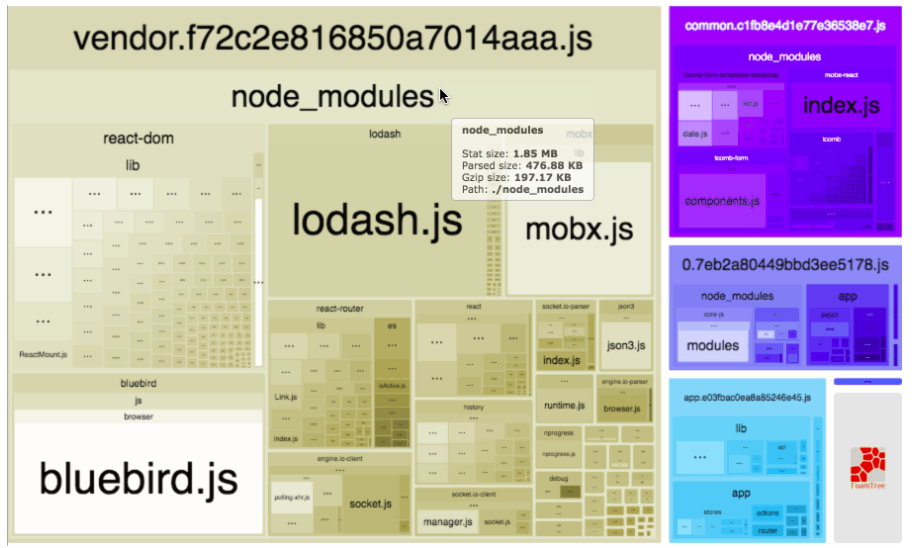

# 通用、封装、简化 webpack 配置

现在，基本上前端的项目打包都会用上 `webpack`，因为 `webpack` 提供了无与伦比强大的功能和生态。但在创建一个项目的时候，总是免不了要配置 `webpack`，很是麻烦。

简化 `webpack` 配置的一种方式是使用社区封装好的库，比如 [roadhog](https://github.com/sorrycc/roadhog)。`roadhog` 封装了 `webpack` 的一些基础配置，然后暴露一些额外配置的接口，并附加本地数据模拟功能(`mock`)，详情可以参考 [roadhog 主页](https://github.com/sorrycc/roadhog)。

另一种方式是自己封装 `webpack`，这样做自己能够更好的掌控项目。

## 1. 要封装哪些功能

一般搭建一个项目至少需要两种功能：本地开发调试、构建产品代码。

其他的诸如测试、部署到服务器、代码检查、格式优化等功能则不在这篇文章讲解范围，如果有意了解，可以查看我的其他文章。

## 2. 基础配置

### 2.1 目录结构（示例，配合后面的代码讲解）

```
package.json
dev.js                       # 本地开发脚本
build.js                     # 产品构建脚本
analyze.js                   # 模块大小分析（可选）

# 单页面结构
src/                         # 源代码目录
  - index.js                 # js 入口文件
  - index.html               # html 入口文件
  - ...                      # 其他文件

# 多页面结构
src/                         # 源代码目录
  - home/                    # home 页面工作空间
    - index.js               # home 页面 js 入口文件
    - index.html             # home 页面 html 入口文件
    - ...                    # home 页面其他文件
    
  - explore/                 # explore 页面工作空间
    - index.js               # explore 页面 js 入口文件
    - index.html             # explore 页面 html 入口文件
    - ...                    # explore 页面其他文件 
     
  - about/                   # about 目录
    - company                # about/company 页面工作空间
      - index.js             # about/company 页面 js 入口文件
      - index.html           # about/company 页面 html 入口文件
      - ...                  # about/company 页面其他文件
      
    - platform               # about/platform 页面工作空间
      - index.js             # about/platform 页面 js 入口文件
      - index.html           # about/platform 页面 html 入口文件
      - ...                  # about/platform 页面其他文件    
  
  - ...                      # 更多页面        
```

### 2.2 基础 npm 包

```
# package.json

"devDependencies": {
  "@babel/core": "^7.1.2",                  # babel core       
  "@babel/plugin-syntax-dynamic-import": "^7.0.0",         # import() 函数支持
  "@babel/plugin-transform-react-jsx": "^7.0.0",           # react jsx 支持
  "@babel/preset-env": "^7.1.0",            # es6+ 转 es5
  "@babel/preset-flow": "^7.0.0",           # flow 支持
  "@babel/preset-react": "^7.0.0",          # react 支持
  "autoprefixer": "^9.1.5",                 # css 自动添加厂家前缀 -webkit-, -moz-
  "babel-loader": "^8.0.4",                 # webpack 加载 js 的 loader
  "babel-plugin-component": "^1.1.1",       # 如果使用 element ui，需要用到这个
  "babel-plugin-flow-runtime": "^0.17.0",   # flow-runtime 支持 
  "babel-plugin-import": "^1.9.1",          # 如果使用 ant-design，需要用到这个
  "browser-sync": "^2.24.7",                # 浏览器实例组件，用于本地开发调试
  "css-loader": "^1.0.0",                   # webpack 加载 css 的 loader
  "chalk": "^2.4.1",                        # 让命令行的信息有颜色
  "file-loader": "^2.0.0",                  # webpack 加载静态文件的 loader
  "flow-runtime": "^0.17.0",                # flow-runtime 包
  "html-loader": "^0.5.5",                  # webpack 加载 html 的 loader
  "html-webpack-include-assets-plugin": "^1.0.5",          # 给 html 文件添加额外静态文件链接的插件
  "html-webpack-plugin": "^3.2.0",          # 更方便操作 html 文件的插件
  "less": "^3.8.1",                         # less 转 css
  "less-loader": "^4.1.0",                  # webpack 加载 less 的 loader
  "mini-css-extract-plugin": "^0.4.3",      # 提取 css 单独打包
  "minimist": "^1.2.0",                     # process.argv 更便捷处理
  "node-sass": "^4.9.3",                    # scss 转 css
  "optimize-css-assets-webpack-plugin": "^5.0.1",          # 优化 css 打包，包括压缩
  "postcss-loader": "^3.0.0",               # 对 css 进行更多操作，比如添加厂家前缀
  "sass-loader": "^7.1.0",                  # webpack 加载 scss 的 loader
  "style-loader": "^0.23.0",                # webpack 加载 style 的 loader
  "uglifyjs-webpack-plugin": "^2.0.1",      # 压缩 js 的插件
  "url-loader": "^1.1.1",                   # file-loader 的升级版
  "vue-loader": "^15.4.2",                  # webpack 加载 vue 的 loader
  "vue-template-compiler": "^2.5.17",       # 配合 vue-loader 使用的 
  "webpack": "^4.20.2",                     # webpack 模块
  "webpack-bundle-analyzer": "^3.0.2",      # 分析当前打包各个模块的大小，决定哪些需要单独打包
  "webpack-dev-middleware": "^3.4.0",       # webpack-dev-server 中间件
  "webpack-hot-middleware": "^2.24.2"       # 热更新中间件
}
```

### 2.3 基本命令

```
# package.json

"scripts": {
  "dev": "node dev.js",
  "build": "node build.js",
  "analyze": "node analyze.js",
}
```

```
npm run dev                                 # 开发
npm run build                               # 构建
npm run analyze                             # 模块分析
```

如果需要支持多入口构建，在命令后面添加参数：

```
npm run dev -- home                         # 开发 home 页面 
npm run analyze -- explore                  # 模块分析 explore 页面 

# 构建多个页面 
npm run build -- home explore about/* about/all --env test/prod  
```

- `home, explore` 确定构建的页面；`about/*, about/all` 指 `about` 目录下所有的页面；`all, *` 整个项目所有的页面
- 有时候可能还会针对不同的服务器环境（比如测试机、正式机）做出不同的构建，可以在后面加参数
- `--` 用来分割 `npm` 本身的参数与脚本参数，参考 [npm - run-script](https://docs.npmjs.com/cli/run-script.html) 了解详情

### 2.4 dev.js 配置

开发一般用需要用到下面的组件：

- [webpack](https://github.com/webpack/webpack)
- [webpack-dev-server](https://github.com/webpack/webpack-dev-server) 或 [webpack-dev-middleware](https://github.com/webpack/webpack-dev-middleware)
- [webpack-hot-middleware](https://github.com/webpack-contrib/webpack-hot-middleware)
- [HotModuleReplacementPlugin](https://webpack.js.org/plugins/hot-module-replacement-plugin/)
- [browser-sync](https://github.com/BrowserSync/browser-sync)

```
const minimist = require('minimist');
const webpack = require('webpack');
const HtmlWebpackPlugin = require('html-webpack-plugin');
const devMiddleWare = require('webpack-dev-middleware');
const hotMiddleWare = require('webpack-hot-middleware');
const browserSync = require('browser-sync');
const VueLoaderPlugin = require('vue-loader/lib/plugin');

const { HotModuleReplacementPlugin } = webpack;

const argv = minimist(process.argv.slice(2));

const page = argv._[0];

 // 单页面
const entryFile = `${__dirname}/src/index.js`;
// 多页面 
const entryFile = `${__dirname}/src/${page}/index.js`; 

// 编译器对象
const compiler = webpack({
  entry: [
    'webpack-hot-middleware/client?reload=true',      // 热重载需要
    entryFile,
  ],
  output: {
    path: `${__dirname}/dev/`,                        // 打包到 dev 目录
    filename: 'index.js',
    publicPath: '/dev/',
  },
  plugins: [
    new HotModuleReplacementPlugin(),                 // 热重载插件
    new HtmlWebpackPlugin({                           // 处理 html
      // 单页面
      template: `${__dirname}/src/index.html`,
      // 多页面
      template: `${__dirname}/src/${page}/index.html`,
    }),
    new VueLoaderPlugin(),                            // vue-loader 所需
  ],
  module: {
    rules: [
      {                                               // js 文件加载器
        loader: 'babel-loader',
        exclude: /node_modules/,
        options: {
          presets: ['@babel/preset-env', '@babel/preset-react'],
          plugins: [
            '@babel/plugin-transform-react-jsx',
            '@babel/plugin-syntax-dynamic-import',
          ],
        },
        test: /\.(js|jsx)$/,
      },
      {                                               // css 文件加载器
        loader: 'style-loader!css-loader',
        test: /\.css$/,
      },
      {                                               // less 文件加载器
        loader: 'style-loader!css-loader!less-loader',
        test: /\.less$/,
      },
      {                                               // scss 文件加载器
        loader: 'style-loader!css-loader!sass-loader',
        test: /\.(scss|sass)$/,
      },
      {                                               // 静态文件加载器
        loader: 'url-loader',
        test: /\.(gif|jpg|png|woff|woff2|svg|eot|ttf|ico)$/,
        options: {
          limit: 1,
        },
      },
      {                                               // html 文件加载器
        loader: 'html-loader',
        test: /\.html$/,
        options: {
          attrs: ['img:src', 'link:href'],
          interpolate: 'require',
        },
      },
      {                                               // vue 文件加载器
        loader: 'vue-loader',
        test: /\.vue$/,
      },
    ],
  },
  resolve: {
    alias: {},                                        // js 配置别名   
    modules: [`${__dirname}/src`, 'node_modules'],    // 模块寻址基路径
    extensions: ['.js', '.jsx', '.vue', '.json'],     // 模块寻址扩展名
  },
  devtool: 'eval-source-map',                         // sourcemap 
  mode: 'development',                                // 指定 webpack 为开发模式
});

// browser-sync 配置
const browserSyncConfig = {
  server: {
    baseDir: `${__dirname}/`,                         // 静态服务器基路径，可以访问项目所有文件 
  },
  startPath: '/dev/index.html',                       // 开启服务器窗口时的默认地址
};

// 添加中间件
browserSyncConfig.middleware = [
  devMiddleWare(compiler, {
    stats: 'errors-only',
    publicPath: '/dev/',
  }),
  hotMiddleWare(compiler),
];

browserSync.init(browserSyncConfig);                  // 初始化浏览器实例，开始调试开发
```

### 2.5 build.js 配置

构建过程中，一般会有这些过程：

1. 提取样式文件，单独打包、压缩、添加浏览器厂家前缀
2. 对 `js` 在产品模式下进行打包，并生成 `sourcemap` 文件 
3. `html-webpack-plugin` 自动把打包好的样式文件与脚本文件引用到 `html` 文件中，并压缩
4. 对所有资源进行 hash 化处理（可选） 

```
const minimist = require('minimist');
const webpack = require('webpack');
const chalk = require('chalk');
const autoprefixer = require('autoprefixer');
const HtmlWebpackPlugin = require('html-webpack-plugin');
const MiniCssExtractPlugin = require('mini-css-extract-plugin');
const OptimizeCssAssetsPlugin = require('optimize-css-assets-webpack-plugin');
const VueLoaderPlugin = require('vue-loader/lib/plugin');

const {yellow, red} = chalk;

const argv = minimist(process.argv.slice(2));

const pages = argv._; // ['home', 'explore', 'about/*', 'about/all']
const allPages = getAllPages(pages); // 根据 page 中的 `*, all` 等关键字，获取所有真正的 pages

// 单页面，只有一个入口，所以只有一个配置文件
const config = { ... }; 

// 多页面，多个入口，所有有多个配置文件
const configs = allPages.map(page => ({
  // 单页面
  entry: `${__dirname}/src/index.js`,                 // js 入口文件
  // 多页面
  entry: `${__dirname}/src/${page}/index.js`,         // js 入口文件
  output: {
    path: `${__dirname}/dist/`,                       // 输出路径
    filename: '[chunkhash].js',                       // 输出文件名，这里完全取 hash 值来命名
    hashDigestLength: 32,                             // hash 值长度
    publicPath: '/dist/',
  },
  plugins: [
    new MiniCssExtractPlugin({                        // 提取所有的样式文件，单独打包
      filename: '[chunkhash].css',                    // 输出文件名，这里完全取 hash 值来命名
    }),
    new HtmlWebpackPlugin({
      // 单页面
      template: `${__dirname}/src/index.html`,        // html 入口文件
      // 多页面
      template: `${__dirname}/src/${page}/index.html`,// html 入口文件
      minify: {                                       // 指定如果压缩 html 文件
        removeComments: !0,
        collapseWhitespace: !0,
        collapseBooleanAttributes: !0,
        removeEmptyAttributes: !0,
        removeScriptTypeAttributes: !0,
        removeStyleLinkTypeAttributes: !0,
        minifyJS: !0,
        minifyCSS: !0,
      },
    }),
    new VueLoaderPlugin(),                            // vue-loader 所需
    new OptimizeCssAssetsPlugin({                     // 压缩 css
      cssProcessorPluginOptions: {
        preset: ['default', { discardComments: { removeAll: true } }],
      },
    }),
    
    // webpack 打包的 js 文件是默认压缩的，所以这里不需要再额外添加 uglifyjs-webpack-plugin
  ],
  module: {
    rules: [
      {                                               // js 文件加载器，与 dev 一致
        loader: 'babel-loader',
        exclude: /node_modules/,
        options: {
          presets: ['@babel/preset-env', '@babel/preset-react'],
          plugins: [
            '@babel/plugin-transform-react-jsx',
            '@babel/plugin-syntax-dynamic-import',
          ],
        },
        test: /\.(js|jsx)$/,
      },
      {                                               // css 文件加载器，添加了浏览器厂家前缀
        use: [
          MiniCssExtractPlugin.loader,
          'css-loader',
          {
            loader: 'postcss-loader',
            options: {
              plugins: [
                autoprefixer({
                  browsers: [
                    '> 1%',
                    'last 2 versions',
                    'Android >= 3.2',
                    'Firefox >= 20',
                    'iOS 7',
                  ],
                }),
              ],
            },
          },
        ],
        test: /\.css$/,
      },
      {                                               // less 文件加载器，添加了浏览器厂家前缀
        use: [
          MiniCssExtractPlugin.loader,
          'css-loader',
          {
            loader: 'postcss-loader',
            options: {
              plugins: [
                autoprefixer({
                  browsers: [
                    '> 1%',
                    'last 2 versions',
                    'Android >= 3.2',
                    'Firefox >= 20',
                    'iOS 7',
                  ],
                }),
              ],
            },
          },
          'less-loader',
        ],
        test: /\.less$/,
      },
      {                                               // scss 文件加载器，添加了浏览器厂家前缀
        use: [
          MiniCssExtractPlugin.loader,
          'css-loader',
          {
            loader: 'postcss-loader',
            options: {
              plugins: [
                autoprefixer({
                  browsers: [
                    '> 1%',
                    'last 2 versions',
                    'Android >= 3.2',
                    'Firefox >= 20',
                    'iOS 7',
                  ],
                }),
              ],
            },
          },
          'sass-loader',
        ],
        test: /\.(scss|sass)$/,
      },
      {                                               // 静态文件加载器，与 dev 一致
        loader: 'url-loader',
        test: /\.(gif|jpg|png|woff|woff2|svg|eot|ttf|ico)$/,
        options: {
          limit: 1,
        },
      },
      {                                               // html 文件加载器，与 dev 一致
        loader: 'html-loader',
        test: /\.html$/,
        options: {
          attrs: ['img:src', 'link:href'],
          interpolate: 'require',
        },
      },
      {                                               // vue 文件加载器，与 dev 一致
        loader: 'vue-loader',
        test: /\.vue$/,
      },
    ],
  },
  resolve: {
    alias: {},                                        // js 配置别名   
    modules: [`${__dirname}/src`, 'node_modules'],    // 模块寻址基路径
    extensions: ['.js', '.jsx', '.vue', '.json'],     // 模块寻址扩展名
  },
  devtool: 'source-map',                              // sourcemap 
  mode: 'production',                                 // 指定 webpack 为产品模式
}));

// 执行一次 webpack 构建
const run = (config, cb) => {
  webpack(config, (err, stats) => {
    if (err) {
      console.error(red(err.stack || err));
      if (err.details) {
        console.error(red(err.details));
      }
      process.exit(1);
    }
  
    const info = stats.toJson();
  
    if (stats.hasErrors()) {
      info.errors.forEach(error => {
        console.error(red(error));
      });
      process.exit(1);
    }
  
    if (stats.hasWarnings()) {
      info.warnings.forEach(warning => {
        console.warn(yellow(warning));
      });
    }
    
    // 如果是多页面，需要把 index.html => `${page}.html`
    // 因为每个页面导出的 html 文件都是 index.html 如果不重新命名，会被覆盖掉
    
    if(cb) cb();
  });
};

// 单页面
run(config);

// 多页面
let index = 0;
// go on
const goon = () => {
  run(configs[index], () => {
    index += 1;

    if (index < configs.length) goon();
  });
};

goon();
```

### 2.6 analyze.js 配置



```
const minimist = require('minimist');
const chalk = require('chalk');
const webpack = require('webpack');
const { BundleAnalyzerPlugin } = require('webpack-bundle-analyzer');
const VueLoaderPlugin = require('vue-loader/lib/plugin');

const {yellow, red} = chalk;

const argv = minimist(process.argv.slice(2));

const page = argv._[0];

 // 单页面
const entryFile = `${__dirname}/src/index.js`;
// 多页面 
const entryFile = `${__dirname}/src/${page}/index.js`; 

const config = {
  entry: entryFile,
  output: {
    path: `${__dirname}/analyze/`,                    // 打包到 analyze 目录
    filename: 'index.js',
  },
  plugins: [
    new VueLoaderPlugin(),                            // vue-loader 所需
    new BundleAnalyzerPlugin(),                       // 添加插件 
  ],
  module: {
    rules: [
      {                                               // js 文件加载器
        loader: 'babel-loader',
        exclude: /node_modules/,
        options: {
          presets: ['@babel/preset-env', '@babel/preset-react'],
          plugins: [
            '@babel/plugin-transform-react-jsx',
            '@babel/plugin-syntax-dynamic-import',
          ],
        },
        test: /\.(js|jsx)$/,
      },
      {                                               // css 文件加载器
        loader: 'style-loader!css-loader',
        test: /\.css$/,
      },
      {                                               // less 文件加载器
        loader: 'style-loader!css-loader!less-loader',
        test: /\.less$/,
      },
      {                                               // scss 文件加载器
        loader: 'style-loader!css-loader!sass-loader',
        test: /\.(scss|sass)$/,
      },
      {                                               // 静态文件加载器
        loader: 'url-loader',
        test: /\.(gif|jpg|png|woff|woff2|svg|eot|ttf|ico)$/,
        options: {
          limit: 1,
        },
      },
      {                                               // html 文件加载器
        loader: 'html-loader',
        test: /\.html$/,
        options: {
          attrs: ['img:src', 'link:href'],
          interpolate: 'require',
        },
      },
      {                                               // vue 文件加载器
        loader: 'vue-loader',
        test: /\.vue$/,
      },
    ],
  },
  resolve: {
    alias: {},                                        // js 配置别名   
    modules: [`${__dirname}/src`, 'node_modules'],    // 模块寻址基路径
    extensions: ['.js', '.jsx', '.vue', '.json'],     // 模块寻址扩展名
  },
  mode: 'production',                                 // 指定 webpack 为产品模式
};

webpack(config, (err, stats) => {
  if (err) {
    console.error(red(err.stack || err));
    if (err.details) {
      console.error(red(err.details));
    }
    process.exit(1);
  }

  const info = stats.toJson();

  if (stats.hasErrors()) {
    info.errors.forEach(error => {
      console.error(red(error));
    });
    process.exit(1);
  }

  if (stats.hasWarnings()) {
    info.warnings.forEach(warning => {
      console.warn(yellow(warning));
    });
  }
});
```

### 2.7 扩展配置

你可以根据需要扩展配置，比如添加插件、加载器等，比如：

- [provide-plugin](https://webpack.js.org/plugins/provide-plugin/) 可以提供一些全局模块的导出，比如 `jquery`
- [define-plugin](https://webpack.js.org/plugins/define-plugin/) 可以动态定义一些全局变量
- [css-loader](https://github.com/webpack-contrib/css-loader) 可以配置成 [css-modules](https://github.com/css-modules/css-modules)
- 如果某个页面导出 `js bundle` 很大，想分割成多个文件，可以使用 [dll-plugin](https://webpack.js.org/plugins/dll-plugin/)、[split-chunks-plugin](https://webpack.js.org/plugins/split-chunks-plugin/)  
- 如果想在命令行显示构建的进度，可以使用 [progress-plugin](https://webpack.js.org/plugins/progress-plugin/)

## 3. 封装

上面的代码可以封装成一个全局命令，比如 [lila](https://github.com/senntyou/lila)，运行上面的命令就可以更简洁：

```
lila dev home                               # 开发 home 页面 
lila analyze explore                        # 模块分析 explore 页面 

# 构建多个页面 
lila build home explore about/* about/all --env test/prod
```

## 后续

更多博客，查看 [https://github.com/senntyou/blogs](https://github.com/senntyou/blogs)

作者：[深予之 (@senntyou)](https://github.com/senntyou)

版权声明：自由转载-非商用-非衍生-保持署名（[创意共享3.0许可证](https://creativecommons.org/licenses/by-nc-nd/3.0/deed.zh)）
