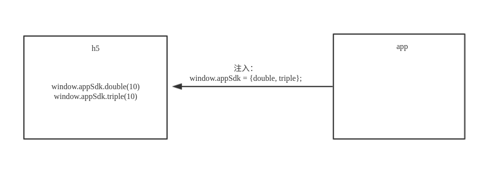

# h5 与原生 app 交互的原理

现在移动端 web 应用，很多时候都需要与原生 app 进行交互、沟通（运行在 `webview` 中），比如微信的 `jssdk`，通过 `window.wx` 对象调用一些原生 app 的功能。所以，这次就来捋一捋 h5 与原生 app 交互的原理。

h5 与原生 app 的交互，本质上说，就是两种调用：

1. app 调用 h5 的代码
2. h5 调用 app 的代码

## 1. app 调用 h5 的代码

因为 app 是宿主，可以直接访问 h5，所以这种调用比较简单，就是在 h5 中曝露一些全局对象（包括方法），然后在原生 app 中调用这些对象。


***javascript***

```
window.sdk = {
  double = value => value * 2,
  triple = value => value * 3,
};
```

***android***

```
webview.evaluateJavascript('window.sdk.double(10)', new ValueCallback<String>() {
  @Override
  public void onReceiveValue(String s) {
    // 20
  }
});
```

***ios***

```
NSString *func = @"window.sdk.double(10)";
NSString *str = [webview stringByEvaluatingJavaScriptFromString:func]; // 20
```

## 2. h5 调用 app 的代码

因为 h5 不能直接访问宿主 app，所以这种调用就相对复杂一点。

这种调用常用有两种方式：

1. 由 app 向 h5 注入一个全局 `js` 对象，然后在 h5 直接访问这个对象
2. 由 h5 发起一个自定义协议请求，app 拦截这个请求后，再由 app 调用 h5 中的回调函数

### 2.1 由 app 向 h5 注入一个全局 `js` 对象

这种方式沟通机制简单，比较好理解，并且对于 h5 来说，没有新的东西，所以是比较推荐的一种方式。但这种方式可能存在安全隐患，详细查看 [你不知道的 Android WebView 使用漏洞](https://www.jianshu.com/p/3a345d27cd42)。



***android***

```
webview.addJavascriptInterface(new Object() {
  @JavascriptInterface
  public int double(value) {
    return value * 2;
  }
  
  @JavascriptInterface
  public int triple(value) {
    return value * 3;
  }
}, "appSdk");
```

***ios***

```
NSString *scripts = @"window.appSdk = {double: value => value * 2, triple: value => value * 3}";
[webview stringByEvaluatingJavaScriptFromString:scripts];
```

***javascript***

```
window.appSdk.double(10); // 20
```

### 2.2 由 h5 发起一个自定义协议请求

这种方式要稍复杂一点，因为需要自定义协议，这对很多前端开发者来说是比较新的东西。所以一般不推荐这种方式，可以作为第一种方式的补充。

大致需要以下几个步骤：

1. 由 app 自定义协议，比如 `sdk://action?params`
2. 在 h5 定义好回调函数，比如 `window.bridge = {getDouble: value => {}, getTriple: value => {}}`
3. 由 h5 发起一个自定义协议请求，比如 `location.href = 'sdk://double?value=10'`
4. app 拦截这个请求后，进行相应的操作，获取返回值
5. 由 app 调用 h5 中的回调函数，比如 `window.bridge.getDouble(20);`


***javascript***

```
window.bridge = {
  getDouble: value => {
    // 20
  }, 
  getTriple: value => {
    // more  
  }
};

location.href = 'sdk://double?value=10';
```

***android***

```
webview.setWebViewClient(new WebViewClient() {
    @Override
    public boolean shouldOverrideUrlLoading(WebView view, String url) {
        // 判断如果 url 是 sdk:// 打头的就拦截掉
        // 然后从 url sdk://action?params 中取出 action 与params 
        
        Uri uri = Uri.parse(url);                                 
        if ( uri.getScheme().equals("sdk")) {

            // 比如 action = double, params = value=10
            webview.evaluateJavascript('window.bridge.getDouble(20)');

            return true;
        }
        return super.shouldOverrideUrlLoading(view, url);
    }
});
```

***ios***

```
- (BOOL)webview:(UIWebView *)webview shouldStartLoadWithRequest:(NSURLRequest *)request navigationType:(UIWebViewNavigationType)navigationType {
  // 判断如果 url 是 sdk:// 打头的就拦截掉
  // 然后从 url sdk://action?params 中取出 action 与params

  NSString *urlStr = request.URL.absoluteString;
  
  if ([urlStr hasPrefix:@"sdk://"]) {
    
    // 比如 action = double, params = value=10
    NSString *func = @"window.bridge.getDouble(20)";
    [webview stringByEvaluatingJavaScriptFromString:func];

    return NO;
  }

  return YES;
}
```

## 后续

更多博客，查看 [https://github.com/senntyou/blogs](https://github.com/senntyou/blogs)

作者：[深予之 (@senntyou)](https://github.com/senntyou)

版权声明：自由转载-非商用-非衍生-保持署名（[创意共享3.0许可证](https://creativecommons.org/licenses/by-nc-nd/3.0/deed.zh)）
