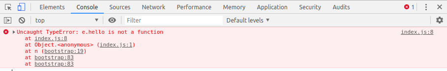

# 细说 js 压缩、sourcemap、通过 sourcemap 查找原始报错信息

## 1. `js` 压缩 

`js` 压缩对前端开发者来说是一门必修课。

一般来说，压缩 `js` 主要出于以下两个目的：

1. 减小代码体积，加快前端资源加载速度
2. 保护源代码不被别人获取

压缩 `js` 使用的工具库：

- [UglifyJS2](https://github.com/mishoo/UglifyJS2): 压缩 `es5`
- [uglify-es](https://github.com/mishoo/UglifyJS2/tree/harmony): 压缩 `es6+`
- [closure-compiler](https://github.com/google/closure-compiler)、[closure-compiler-js](https://github.com/google/closure-compiler-js): `google` 的 `js` 压缩、优化工具

压缩 `js` 的主要过程：

1. 移除无用代码
2. 混淆代码中变量名称、函数名称等
3. 预编译代码
4. 对结构进行扁平化处理

##### 1. 移除无用代码

去掉所有对解析引擎来说无用的字符，包括空格、注释、换行、没有用的变量声明、函数声明等。

##### 2. 混淆代码中变量名称、函数名称等

把一些局部变量名称、函数名称等用 `a, b, ...`、`$1, $2, ...`、`_1, _2, ...` 之类的简略字符进行替换，达到混淆的目的。

源代码

```
(function () {
  var hello = 'hi';
  var print = function (str) {
    console.log(str);
  };

  print(hello);
})();
```

压缩后的代码（仅演示混淆功能）

```
(function () {
  var a = 'hi';
  var b = function (c) {
    console.log(c);
  };

  b(a);
})();
```

##### 3. 预编译代码

把不依赖外部环境的逻辑提前进行运算，并把运算结果替换到相应的源码处，然后从源码中移除这段逻辑。

源代码

```
(function () {
  var hello = 'hi' + ' everyone, ';
  var count = 3 * 5;

  console.log(hello + count + ' girls');
})();
```

压缩后的代码（仅演示预编译功能）

```
(function () {
  var hello = 'hi everyone, ';
  var count = 15;

  console.log(hello + count + ' girls');
})();
```

##### 4. 对结构进行扁平化处理

对于 `js` 来说，嵌套越深，执行越慢，对代码进行扁平化处理也是优化代码的一种方式。

源代码

```
(function () {
  var say = {
    hello: function (str) {
      console.log('hello ' + str);
    }
  };

  say.hello('everyone');
})();
```

压缩后的代码（仅演示扁平化结构功能）

```
!function(str){console.log("hello "+str)}("everyone");
```

##### 完整示例

源代码

```
(function () {
  var say = {
    hello: function (str) {
      console.log('hello ' + str);
    }
  };

  say.hello('everyone');
})();
```

压缩后的代码

```
!function(l){console.log("hello "+l)}("50 girls");
```

## 2. `sourcemap`

通常 `js` 压缩后只有一行代码，并且里面的变量名与函数名等都是混淆了的，这在实际运行中会有一个问题，就是 `js` 的报错信息将会失真，无法追踪到是在源代码哪一行哪一列报的错。

`sourcemap` 便是为了解决这个问题而生的。

`sourcemap` 文件就是记录了从源代码文件到压缩文件的一个代码对应关系记录表，通过压缩文件和 `sourcemap` 文件可以原原本本找出源代码文件。

查看阮一峰老师的 [JavaScript Source Map 详解](http://www.ruanyifeng.com/blog/2013/01/javascript_source_map.html) 了解 `sourcemap` 的原理与格式。

一般在压缩 `js` 的过程中，会生成相应的 `sourcemap` 文件，并且在压缩的 `js` 文件末尾追加 `sourcemap` 文件的链接。这样，浏览器在加载这个压缩 `js` 的时候，就知道还有一个相应的 `sourcemap` 文件，也一并加载下来，运行的过程中如果 `js` 报错，也会给出相应源代码的行号与列号，而非压缩文件的。

比如，对下面的源码进行压缩：

```
(function () {
  var say = {
    hi: function () {
      console.log('hi');
    }
  };

  say.hello();

  return say;
})();
```

未加 `sourcemap` 文件时，报错信息是：


加上 `sourcemap` 文件时，报错信息是：




### `sourcemap` 扩展

[webpack](https://github.com/webpack/webpack) 对 `sourcemap` 做了扩展，定义在 `devtool` 配置项中：

- `eval`: 每个模块都使用 `eval()` 执行，并且都有 `//@ sourceURL`，构建很快，但无法正确显示行号
- `eval-source-map`: 每个模块使用 `eval()` 执行，并且 `source map` 转换为 `DataUrl` 后添加到 `eval()` 中，一般开发模式中使用这种方式
- `cheap-eval-source-map`: 类似 `eval-source-map`，但只映射行，不映射列，并忽略源自 `loader` 的 `source map`，仅显示转译后的代码
- `cheap-module-eval-source-map`: 类似 `cheap-eval-source-map`，但会保留源自 `loader` 的 `source map`

- `inline-source-map`: `source map` 转换为 `DataUrl` 后添加到 `bundle` 中
- `cheap-source-map`: 只映射行，不映射列，并忽略源自 `loader` 的 `source map`，仅显示转译后的代码
- `inline-cheap-source-map`: `inline-source-map` 与 `cheap-source-map` 的结合
- `cheap-module-source-map`: 类似 `cheap-module-eval-source-map`，但不使用 `eval()` 执行
- `inline-cheap-module-source-map`: `inline-source-map` 与 `cheap-module-source-map` 的结合

- `source-map`: 整个 `source map` 作为一个单独的文件生成，产品环境一般使用这种模式 
- `hidden-source-map`: 类似 `source-map`，但不会把 `//# sourceMappingURL=bundle-file-name.js.map` 追加到压缩文件后面 
- `nosources-source-map`: 类似 `source-map`，但只有堆栈信息，没有源码信息 

### 使用建议

对于使用 [webpack](https://github.com/webpack/webpack) 来构建项目，建议开开发时使用 `eval-source-map`，产品环境使用 `source-map`。

因为用压缩文件与 `sourcemap` 文件是可以原原本本的找到源代码的，所以，为了保护源代码，可以这样隐藏 `sourcemap` 文件：

1. 在 `web` 服务器设置外部不能访问 `sourcemap` 文件，只能内部访问
2. 直接把 `sourcemap` 文件存放到其他地方

## 后续

更多博客，查看 [https://github.com/senntyou/blogs](https://github.com/senntyou/blogs)

作者：[深予之 (@senntyou)](https://github.com/senntyou)

版权声明：自由转载-非商用-非衍生-保持署名（[创意共享3.0许可证](https://creativecommons.org/licenses/by-nc-nd/3.0/deed.zh)）
