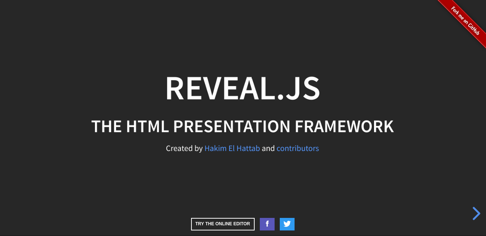
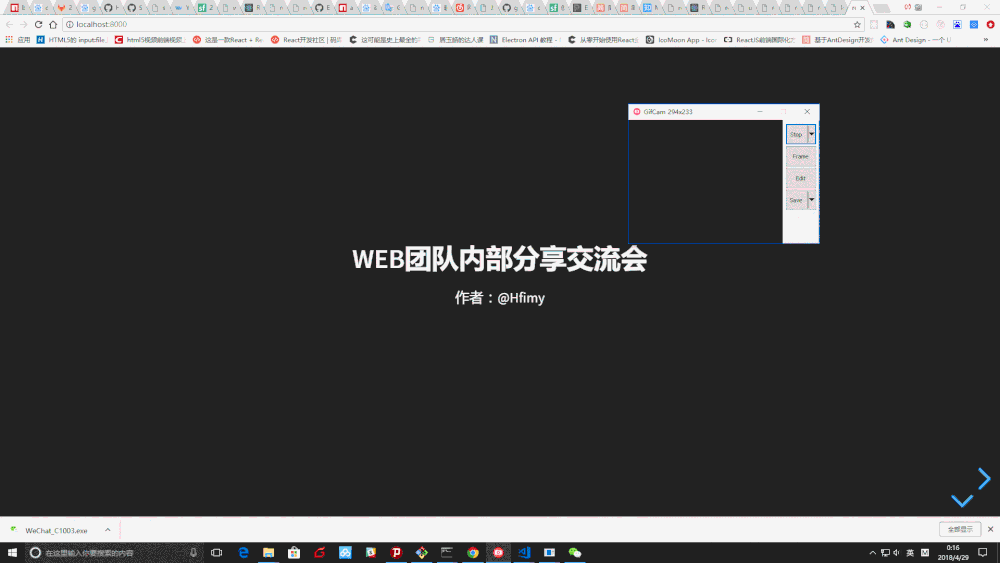
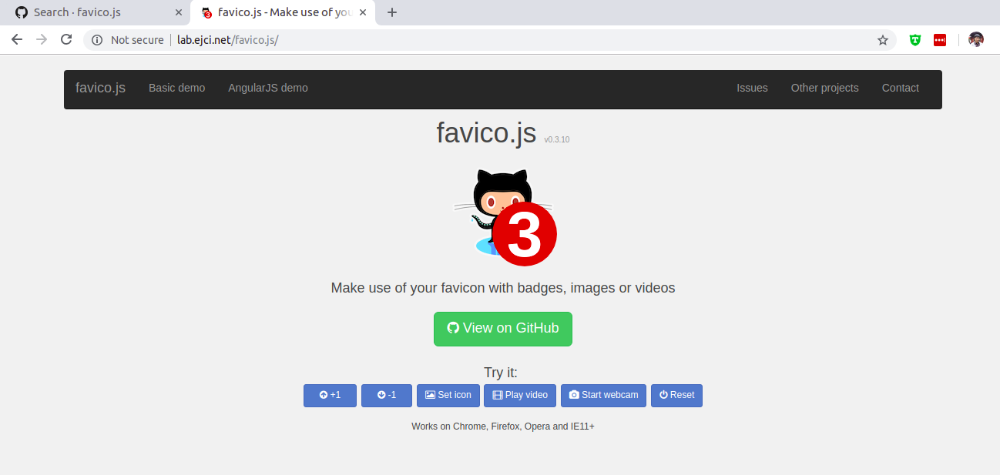
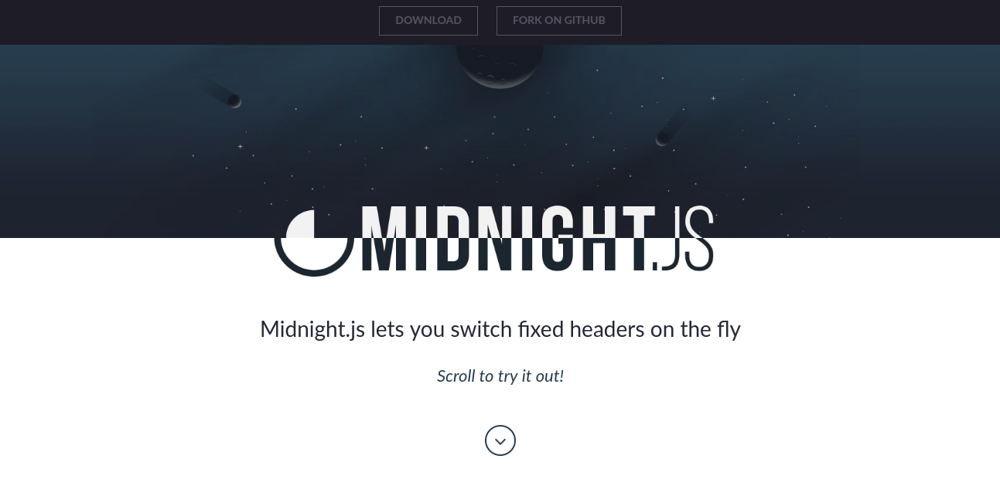

# github 上有趣又实用的前端项目（持续更新，欢迎补充）

## 1. [reveal.js](https://github.com/hakimel/reveal.js): 幻灯片展示框架

一个专门用来做 HTML 幻灯片的框架，支持 HTML 和 Markdown 语法。

- `github`: [https://github.com/hakimel/reveal.js](https://github.com/hakimel/reveal.js)
- `demo`: [https://revealjs.com](https://revealjs.com)

动图取自博客 [reveal.js - 程序员的PPT制作神器](https://www.jianshu.com/p/b58c365d98c1)。

## 2. [impress.js](https://github.com/impress/impress.js): 又一个幻灯片展示框架

一个受 [https://prezi.com/](https://prezi.com/) 的启发，使用了现代浏览器里支持的 CSS3 transforms 和 transitions 的特效幻灯片。

我的个人网站首页 [https://www.senntyou.com/](https://www.senntyou.com/) 也是用 `impress.js` 开发的。

- `github`: [https://github.com/impress/impress.js](https://github.com/impress/impress.js)
- `demo`: [https://impress.js.org/](https://impress.js.org/)

## 3. [particles.js](https://github.com/VincentGarreau/particles.js): 超棒的粒子效果

- `github`: [https://github.com/VincentGarreau/particles.js](https://github.com/VincentGarreau/particles.js)
- `demo`: [https://vincentgarreau.com/particles.js/](https://vincentgarreau.com/particles.js/)

## 4. [carbon](https://github.com/dawnlabs/carbon): 代码美图生成器

可以将你的代码生成美美的图片，然后你就可以分享到各个社区了。

- `github`: [https://github.com/dawnlabs/carbon](https://github.com/dawnlabs/carbon)
- `demo`: [https://dawnlabs.io/carbon](https://dawnlabs.io/carbon)

## 5. [favico.js](https://github.com/ejci/favico.js): 让你的 `favicon` 用上胶囊图标、图片和视频

- `github`: [https://github.com/ejci/favico.js](https://github.com/ejci/favico.js)
- `demo`: [http://lab.ejci.net/favico.js/](http://lab.ejci.net/favico.js/)

 

## 6. [typed.js](https://github.com/mattboldt/typed.js): 打字机效果库

- `github`: [https://github.com/mattboldt/typed.js](https://github.com/mattboldt/typed.js)
- `demo`: [https://mattboldt.com/demos/typed-js/](https://mattboldt.com/demos/typed-js/)

## 7. [vConsole](https://github.com/Tencent/vConsole): 移动端开发调试利器

`vConsole`： 一个轻量、可拓展、针对手机网页的前端开发者调试面板（`chrome` 开发者工具的便利实现）。

一般在 web 应用开发过程中，可以用 `console.log` 去输出一些信息，但是在移动端，`console.log` 的信息是看不到的。

这种情况下，当然可以选择使用 `alert` 弹出一些信息，但是这种方法实在不怎么方便，也会阻断 `js` 事件循环，调试体验和效率都很差。

好在有 `vConsole` 可以帮助我们解决这个问题。

- `github`: [https://github.com/Tencent/vConsole](https://github.com/Tencent/vConsole)
- `demo`: [https://wechatfe.github.io/vconsole/demo.html](https://wechatfe.github.io/vconsole/demo.html)

## 8. [midnight.js](https://github.com/Aerolab/midnight.js): 固定头部炫酷效果

- `github`: [https://github.com/Aerolab/midnight.js](https://github.com/Aerolab/midnight.js)
- `demo`: [https://aerolab.github.io/midnight.js/](https://aerolab.github.io/midnight.js/)

## 9. [multiscroll.js](https://github.com/alvarotrigo/multiscroll.js): 多边滑动效果

- `github`: [https://github.com/alvarotrigo/multiscroll.js](https://github.com/alvarotrigo/multiscroll.js)
- `demo`: [https://alvarotrigo.com/multiScroll/](https://alvarotrigo.com/multiScroll/)

## 10. [diaporama](https://github.com/gre/diaporama): `Kenburns` 效果 与 `glsl` 转换动画库

- `github`: [https://github.com/gre/diaporama](https://github.com/gre/diaporama)
- `demo`: [http://greweb.me/diaporama/](http://greweb.me/diaporama/)

## 11. [RainEffect](https://github.com/codrops/RainEffect): 雨滴效果

- `github`: [https://github.com/codrops/RainEffect](https://github.com/codrops/RainEffect)
- `demo`: [https://tympanus.net/Development/RainEffect/](https://tympanus.net/Development/RainEffect/)

## 后续

更多博客，查看 [https://github.com/senntyou/blogs](https://github.com/senntyou/blogs)

作者：[深予之 (@senntyou)](https://github.com/senntyou)

版权声明：自由转载-非商用-非衍生-保持署名（[创意共享3.0许可证](https://creativecommons.org/licenses/by-nc-nd/3.0/deed.zh)）
