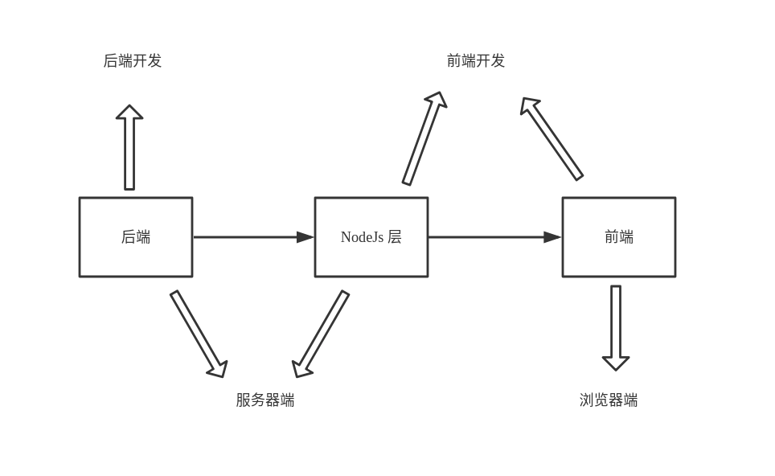

# 细说 Vue 组件的服务器端渲染

> 声明：需要读者对 NodeJs、Vue 服务器端渲染有一定的了解

现在，前后端分离与客户端渲染已经成为前端开发的主流模式，绝大部分的前端应用都适合用这种方式来开发，又特别是 React、Vue 等组件技术的发展，更是使这种方式深入人心。

但有一些应用，客户端渲染就会遇到一些问题了：

1. 需要做 SEO（搜索引擎优化），但客户端渲染的 `html` 中几乎没有可用的信息
2. 需要首屏快速加载，但客户端渲染一般是长时间的加载动画或者白屏

如果能把客户端渲染的组件化技术（React、Vue 等）与传统的后端渲染的方式有效的结合起来，两者兼具，那就太完美了。

所以，这次就来聊聊 Vue 组件的服务器端渲染。

根据社区现有的一些方案，结合自己的实践，针对团队技术力量的不同，说说不同应用场景选择方案时的优先级。

## 1. NodeJs 渲染中间层

一般前后端的工作流是 `后端 -> 前端`。

传统的后端渲染模式是后端负责包括 url、接口、模板渲染等，前端与后端耦合在一起，当然这种方式正在慢慢的退出历史舞台。

主流的客户端渲染则是后端只提供接口（如有需要，可以提供必要的 url），前端与后端只通过接口交流数据，路由与渲染都在前端完成。

而 NodeJs 渲染中间层的工作流则是 `后端 -> NodeJs -> 前端`（NodeJs 渲染中间层由前端开发人员掌握）。



这种模式下，后端只提供接口，传统的服务器端路由（url）、模板渲染则都有 NodeJs 层接管。这样，前端开发人员可以自由的决定哪些组件需要在服务器端渲染，哪些组件可以放在客户端渲染，前后端完全解耦，但又保留了服务器端渲染的功能。

这种方案最成熟的是 [nuxt.js](https://github.com/nuxt/nuxt.js)。

如果有需要，大家可以自己去 [nuxt.js 官方文档](https://zh.nuxtjs.org/) 看看具体的使用方法和详细的功能。

应该说，这种方式是目前最完美的一种方案，但也有一些隐患：

1. 增加了一个 NodeJs 中间层，应用性能会有所降低
2. 增加了架构的复杂度、不稳定性，也降低了应用的安全性
3. 对于高并发应用，NodeJs 层会很容易形成瓶颈
4. 对开发人员要求高了很多

所以，这种方式适合对并发量、安全性、稳定性等要求不高，但又需要做 SEO 或首屏快速加载的页面。

当然，如果你能够自己改造相关的工具，就另当别论了。

## 2. 保留后端模板渲染

当不能使用 NodeJs 中间层时，而又要达到 SEO 与首屏快速响应的目的时，在传统的后端模板渲染的基础上，就需要对前端的页面加以适当的改造。

### 2.1 首屏快速响应

首屏快速响应就意味着首屏渲染所需的数据是跟 HTML 文件一起到达浏览器的，这些数据当前是由后端模板引擎嵌入到 HTML 页面中的。

以 Java 的 [freemarker](https://freemarker.apache.org/) 模板引擎为例：

（`html` 中以 `script` 的方式获取模板的数据，这样就算是在本地调试、开发，也不会报错）。

```
<script>
  window.globalData = {
    stringValue: '${stringValueTplName}',
    intValue: parseInt('${intValueTplName}', 10),
  };
</script>
```

如果是复杂的 Json 数据或者其他复杂的模板数据（比如列表数据），则可以像下面这样接收：

```
<script type="text/tpl" id="tpl-script-json">
  window.tmpData = {
    jsonValue: ${jsonValueTplName},
  };
</script>

<script>
  try {
    eval(document.getElementById('tpl-script-json').innerText);
  } catch (e) {
    window.tmpData = { jsonValue: {} };
  }

  window.globalData = {
    jsonValue: window.tmpData.jsonValue,
  };
</script>
```

这样，你就可以在组件里使用 `window.globalData` 的数据了，而不用另外用接口获取数据，达到加快首屏渲染的目的，而且本地开发、调试也不会报错。

如果你使用了本地数据 Mock 功能，也可以很容易的与这种方式结合在一起，只要稍加改造：

1. 在代码中定义本地和服务器两个环境，本地环境使用 Mock 数据，服务器环境使用 `window.globalData`
2. 可以使用 [see-ajax](https://github.com/deepraining/see-ajax), [see-fetch](https://github.com/deepraining/see-fetch) 来简化这种方式的开发

此外，还有一些措施来进一步加快首屏渲染：

1. 尽量减少首屏加载的脚本文件大小，其他脚本可以按需加载
2. 如果需要，可以将 CSS、JS 内容注入到 HTML 中，这样就只会发起一个请求，也可以加快加载速度

### 2.2 SEO 优化

在上面加载首屏渲染的基础上，对于 SEO 优化也可以做相应的改造。

其实，在客户端渲染已慢慢成为主流开发模式的同时，搜索引擎也在跟进这种变化。

截至目前，Google 和 Bing 可以很好对同步 JavaScript 应用程序进行索引，也就是说，即使是客户端渲染，但只要是同步数据渲染（非 Ajax 获取数据，比如模板数据），搜索引擎也能抓取到相应的 HTML 片段。

（国内的百度搜索与 360 搜索等暂时还没有跟进动态）

但为了兼容所有的搜索引擎，可以像下面改造：

1. 先由后端模板引擎渲染一些 HTML 片段，仅给搜索引擎抓取，不作为给用户展示的页面
2. 然后再由客户端渲染同步或异步的数据给用户展示真正的页面

```
<div>
  <!-- 这里放置由后端模板引擎渲染的专给搜索引擎抓取的片段，用户不可见 -->
</div>

<script>
  // 接收同步数据
  window.globalData = {
    stringValue: '${stringValueTplName}',
    intValue: parseInt('${intValueTplName}', 10),
  };
</script>
```

## 3. 导出静态 html

如果页面没有动态数据，那就好办了，直接把组件导出为静态 html，然后由客户端激活。

具体过程可以参考 [官方文档](https://ssr.vuejs.org/zh/guide/hydration.html)。

这种方案比较好的是 [nuxt.js](https://github.com/nuxt/nuxt.js) `generate` 静态 HTML 文件。

目录结构：

```
- pages/                # 页面结构目录
  - index.vue
  - second.vue
  - ...
- nuxt.config.js        # 配置文件
- package.json

- dist                  # 导出静态 HTML 文件的默认目录
```

导出静态 HTML 文件

```
npx nuxt generate
```

如果一个项目里有多个 `pages`，可以这样构建：

目录结构：

```
- nuxt.config.js        # 配置文件
- package.json

- src/
  - home/               # home 页面
    - pages/            # 页面结构目录
      - index.vue
      - second.vue
      - ...

    - dist              # 导出静态 HTML 文件的默认目录
  - about/              # about 页面
    - pages/            # 页面结构目录
      - index.vue
      - second.vue
      - ...

    - dist              # 导出静态 HTML 文件的默认目录
```

导出静态 HTML 文件

```
npx nuxt generate src/home -c ../../nuxt.config.js    # home 页面
npx nuxt generate src/about -c ../../nuxt.config.js   # about 页面
```

除了上面提到的这些方式外，当然还有其他的方式，比如：

1. 使用 Chrome Headless 模式获取组件的静态 HTML，参考 [react-snap](https://github.com/stereobooster/react-snap), [puppeteer](https://github.com/GoogleChrome/puppeteer)
2. 官方 [vue-server-renderer](https://ssr.vuejs.org/zh/) 导出静态 HTML

## 4. 总结

因为模式的改变，服务器端渲染与传统的后端模板渲染工作方式有很大的不同，所以在开发时需要与后端开发人员做好沟通，避免认知上的不同导致协作不协调。

## 后续

更多博客，查看 [https://github.com/deepraining/blogs](https://github.com/deepraining/blogs)

作者：[深雨 (@deepraining)](https://github.com/deepraining)

版权声明：自由转载-非商用-非衍生-保持署名（[创意共享 3.0 许可证](https://creativecommons.org/licenses/by-nc-nd/3.0/deed.zh)）
